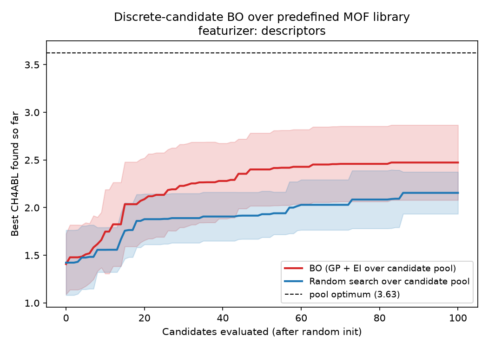

# Optimizing over a predefined candidate space (featurization approach)

This note answers the follow-up on issue
[#3](https://github.com/sgbaird/MOF-GRU/issues/3):

> What about taking the approach of using a predefined candidate space? I.e.,
> treat it as a featurization task similar to what's described in the
> [Honegumi featurization tutorial](https://honegumi.readthedocs.io/en/latest/curriculum/tutorials/featurization/featurization.html).

It complements [`latent-space-optimization.md`](latent-space-optimization.md),
which covers the *generative* (VAE) route. **For this repository, the
predefined-candidate-space / featurization route is the lower-effort, lower-risk
option and is recommended as the first thing to try.**

## The idea

Instead of optimizing a free continuous vector `z` that must be **decoded** back
into a MOF (and might decode to something invalid or off-manifold), you:

1. **Fix the search space to a library of real MOFs.** MOF-GRU already ships one:
   the 113k candidates in `dataset/mof_output.csv`. Any enumerated pool of
   synthesizable MOFs (e.g. a building-block combinatorial enumeration like
   ToBaCCo / the hMOF / QMOF databases) works the same way.
2. **Featurize every candidate** into a continuous vector. This is the
   "featurization" step from the Honegumi/Ax tutorial: categorical/structural
   design choices are turned into numeric features a Gaussian process can model.
3. **Run Bayesian optimization over the discrete pool.** Fit a GP surrogate on
   the already-evaluated candidates and use an acquisition function (Expected
   Improvement) to choose which *existing* candidate to label/evaluate next.

Because every proposal is a row in the library, **every proposal is a real,
valid MOF**. There is no decoder, no invertibility requirement, and none of the
off-manifold/validity failure modes that make optimizing the raw GRU hidden
state unsafe (see §2 of the latent-space note). This is exactly why it is the
safer first option.

## Why this fits MOF-GRU especially well

The objection to optimizing MOF-GRU's `get_hidden_layer_output` embedding
directly was that the encoder is **not invertible** — you cannot decode an
arbitrary `z` back to a MOF. The featurization framing **removes that
requirement entirely**: you only ever evaluate embeddings of MOFs that already
exist, so you never need to invert the encoder. The same pooled hidden state
that was a *liability* for free latent optimization becomes a perfectly good
**featurizer** for a fixed candidate set.

Two featurizers make sense here, and the script supports both:

| Featurizer | Source in repo | Notes |
|---|---|---|
| **Structural descriptors** | `Density, Porosity, PV, PLD, LCD, ASA, …` columns in `dataset/mof_output.csv` (and `mof_GEO.csv`) | Zero training; classic Honegumi-style numeric featurization. |
| **MOF-GRU embedding** | `GRUModel.get_hidden_layer_output` (`models.py`), computed from the SELFIES sentence | Reuses the learned representation MOF-GRU is already trained on; a `2*hidden_size` vector per MOF. |

A learned embedding featurizer is attractive because the GRU was trained to make
the property predictable, so distances in embedding space tend to align with the
objective — a good inductive bias for the GP kernel.

## Worked demonstration (runs on the shipped data)

[`candidate_space_bo/optimize_candidates.py`](../candidate_space_bo/optimize_candidates.py)
implements the full loop and runs on the real MOF library bundled in the repo
(`dataset/mof_output.csv`, read transparently from `dataset/mof_output.zip` or
`MOF-GRU.zip` if the plain CSV is not unpacked). It maximizes a target property
(default `CH4ABL`, the methane deliverable capacity) by selecting candidates from
the fixed pool, and compares **GP+EI Bayesian optimization** against **random
search** over the same pool.

```bash
python candidate_space_bo/optimize_candidates.py \
    --objective CH4ABL --featurizer descriptors \
    --n-candidates 0 --iters 100 --seeds 8
```

Result on the **full library** — all **113,160** real MOFs (`--n-candidates 0`,
no subsampling), averaged over 8 seeds (starting from 10 random candidates):
after 100 evaluations BO reaches a best `CH4ABL` of **~2.47** vs. **~2.16** for
random search (pool optimum **3.63**) — BO finds high-performing MOFs with far
fewer evaluations even when scanning the entire 113k-candidate pool (~6 min,
CPU only). Use a smaller `--n-candidates` (e.g. `6000`) for a faster subsampled
demo.



To use the **learned MOF-GRU embedding** as the featurizer instead of
hand-engineered descriptors, train a `GRUModel` (see `training.py`) and pass the
checkpoint:

```bash
python candidate_space_bo/optimize_candidates.py \
    --objective CH4ABL --featurizer gru \
    --checkpoint my_models/new/biGRU_CH4ABL_model_ep_40_em_80_hd200.pth
```

## How it maps onto a production / Ax+Honegumi setup

The demo uses a lightweight scikit-learn GP to stay dependency-free and fast. The
same recipe scales to the canonical Ax/BoTorch stack from the Honegumi tutorial:

1. **Enumerate** the candidate pool (a `DataFrame` of MOFs).
2. **Featurize** each candidate (descriptor columns and/or
   `get_hidden_layer_output`), optionally standardize.
3. Drive an Ax/BoTorch loop where each trial corresponds to evaluating one
   candidate; restrict the acquisition optimization to the **discrete pool**
   (e.g. `optimize_acqf_discrete`, or a `ChoiceParameter` over candidate ids with
   the features attached). Replace the synthetic "evaluate" step (a lookup of the
   true property in this demo) with the real expensive measurement/simulation.
4. For batched/active learning, use `qNoisyExpectedImprovement` to propose `q`
   candidates per round.

## Trade-offs vs. the generative latent-space (VAE) route

| | Predefined candidate space (this note) | Generative latent space ([VAE note](latent-space-optimization.md)) |
|---|---|---|
| Validity | Guaranteed (candidates are real MOFs) | Needs decode + validate; SELFIES helps |
| New designs | Limited to the enumerated library | Can interpolate/extrapolate to *novel* MOFs |
| Effort | Low — reuse existing data + (optionally) the trained GRU | High — train a VAE decoder + property head |
| Risk | Low — no off-manifold extrapolation | Higher — trust regions / weighted retraining needed |
| Best when | A large, diverse candidate library already exists | You want to invent structures beyond the library |

**Recommendation:** start with the predefined-candidate-space / featurization
approach (cheap, safe, reuses everything already in this repo). Move to the
generative VAE route only when you need to propose MOFs that are not in any
enumerated library.
