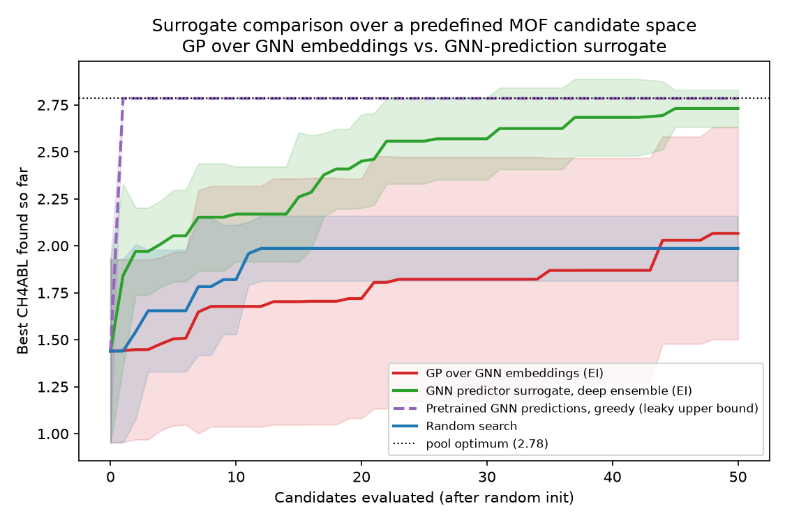
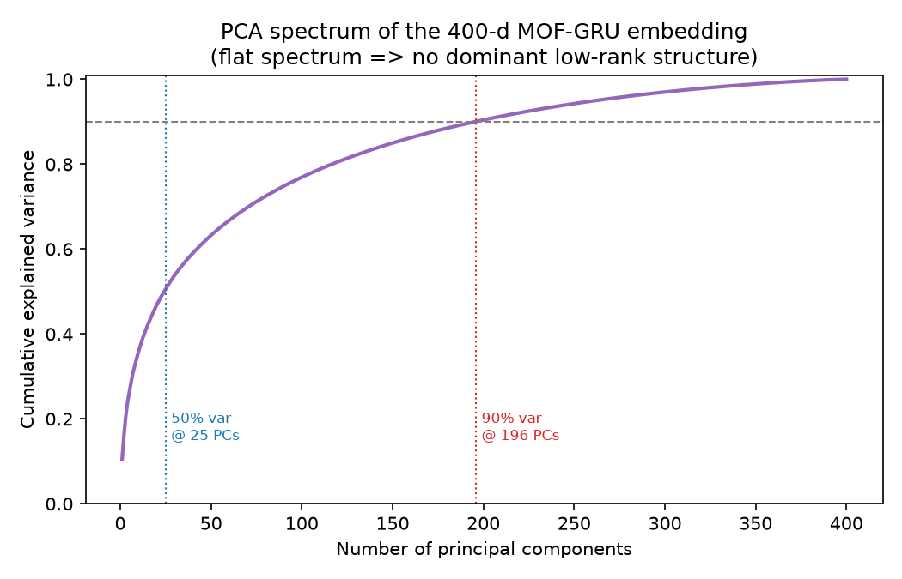
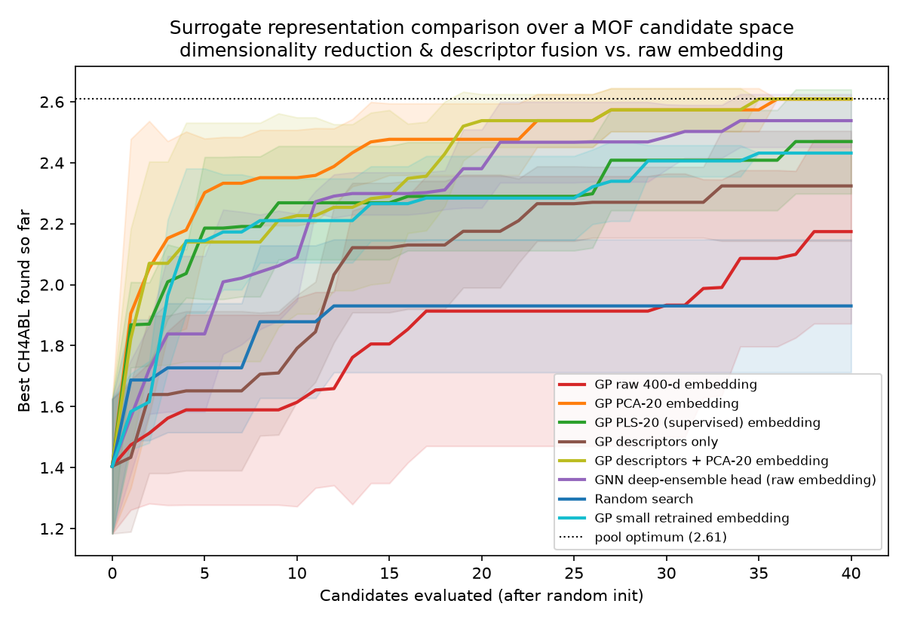

# Optimizing over a predefined candidate space (featurization approach)

This note answers the follow-up on issue
[#3](https://github.com/sgbaird/MOF-GRU/issues/3):

> What about taking the approach of using a predefined candidate space? I.e.,
> treat it as a featurization task similar to what's described in the
> [Honegumi featurization tutorial](https://honegumi.readthedocs.io/en/latest/curriculum/tutorials/featurization/featurization.html).

It complements [`latent-space-optimization.md`](latent-space-optimization.md),
which covers the *generative* (VAE) route. **For this repository, the
predefined-candidate-space / featurization route is the lower-effort, lower-risk
option and is recommended as the first thing to try.**

## The idea

Instead of optimizing a free continuous vector `z` that must be **decoded** back
into a MOF (and might decode to something invalid or off-manifold), you:

1. **Fix the search space to a library of real MOFs.** MOF-GRU already ships one:
   the 113k candidates in `dataset/mof_output.csv`. Any enumerated pool of
   synthesizable MOFs (e.g. a building-block combinatorial enumeration like
   ToBaCCo / the hMOF / QMOF databases) works the same way.
2. **Featurize every candidate** into a continuous vector. This is the
   "featurization" step from the Honegumi/Ax tutorial: categorical/structural
   design choices are turned into numeric features a Gaussian process can model.
3. **Run Bayesian optimization over the discrete pool.** Fit a GP surrogate on
   the already-evaluated candidates and use an acquisition function (Expected
   Improvement) to choose which *existing* candidate to label/evaluate next.

Because every proposal is a row in the library, **every proposal is a real,
valid MOF**. There is no decoder, no invertibility requirement, and none of the
off-manifold/validity failure modes that make optimizing the raw GRU hidden
state unsafe (see §2 of the latent-space note). This is exactly why it is the
safer first option.

## Why this fits MOF-GRU especially well

The objection to optimizing MOF-GRU's `get_hidden_layer_output` embedding
directly was that the encoder is **not invertible** — you cannot decode an
arbitrary `z` back to a MOF. The featurization framing **removes that
requirement entirely**: you only ever evaluate embeddings of MOFs that already
exist, so you never need to invert the encoder. The same pooled hidden state
that was a *liability* for free latent optimization becomes a perfectly good
**featurizer** for a fixed candidate set.

Two featurizers make sense here, and the script supports both:

| Featurizer | Source in repo | Notes |
|---|---|---|
| **Structural descriptors** | `Density, Porosity, PV, PLD, LCD, ASA, …` columns in `dataset/mof_output.csv` (and `mof_GEO.csv`) | Zero training; classic Honegumi-style numeric featurization. |
| **MOF-GRU embedding** | `GRUModel.get_hidden_layer_output` (`models.py`), computed from the SELFIES sentence | Reuses the learned representation MOF-GRU is already trained on; a `2*hidden_size` vector per MOF. |

A learned embedding featurizer is attractive because the GRU was trained to make
the property predictable, so distances in embedding space tend to align with the
objective — a good inductive bias for the GP kernel.

## Worked demonstration (runs on the shipped data)

[`candidate_space_bo/optimize_candidates.py`](../candidate_space_bo/optimize_candidates.py)
implements the full loop and runs on the real MOF library bundled in the repo
(`dataset/mof_output.csv`, read transparently from `dataset/mof_output.zip` or
`MOF-GRU.zip` if the plain CSV is not unpacked). It maximizes a target property
(default `CH4ABL`, the methane deliverable capacity) by selecting candidates from
the fixed pool, and compares **GP+EI Bayesian optimization** against **random
search** over the same pool.

```bash
python candidate_space_bo/optimize_candidates.py \
    --objective CH4ABL --featurizer descriptors \
    --n-candidates 0 --iters 100 --seeds 8
```

Result on the **full library** — all **113,160** real MOFs (`--n-candidates 0`,
no subsampling), averaged over 8 seeds (starting from 10 random candidates):
after 100 evaluations BO reaches a best `CH4ABL` of **~2.47** vs. **~2.16** for
random search (pool optimum **3.63**) — BO finds high-performing MOFs with far
fewer evaluations even when scanning the entire 113k-candidate pool (~6 min,
CPU only). Use a smaller `--n-candidates` (e.g. `6000`) for a faster subsampled
demo.


To use the **learned MOF-GRU embedding** as the featurizer instead of
hand-engineered descriptors, train a `GRUModel` (see `training.py`) and pass the
checkpoint:

```bash
python candidate_space_bo/optimize_candidates.py \
    --objective CH4ABL --featurizer gru \
    --checkpoint my_models/new/biGRU_CH4ABL_model_ep_40_em_80_hd200.pth
```

## Which surrogate? GP over the GNN embedding vs. the GNN's own predictions

A natural follow-up: within this candidate-space loop, should the **surrogate**
be a Gaussian process fit over the MOF-GRU embedding, or the **GNN itself**
making the predictions?
[`candidate_space_bo/gp_vs_gnn_surrogate.py`](../candidate_space_bo/gp_vs_gnn_surrogate.py)
benchmarks both over the *same* frozen MOF-GRU encoder (the 400-d pooled hidden
state, computed once per candidate). Only the surrogate differs:

- **`gp`** — a scikit-learn GP (Matérn + white-noise kernel) is fit on the
  embeddings of the labeled candidates; Expected Improvement picks the next one.
  The GNN is *only* a featurizer; the GP supplies the predictive mean **and** the
  calibrated uncertainty BO needs.
- **`gnn`** — the GNN's own regression head (`Linear(400, 200) → ReLU →
  Linear(200, 1)`, the exact `fc_1`/`fc_2` architecture) is rebuilt on the frozen
  embeddings and **retrained from scratch on the observed labels each round**.
  Epistemic uncertainty comes from a small **deep ensemble** of these heads, so
  the same EI acquisition applies. This is "the GNN making the predictions"
  inside the loop.
- **`gnn-pretrained`** — a reference line that ranks candidates purely by the
  *pretrained* MOF-GRU's end-to-end predictions (greedy, no re-fitting). It is
  the literal "GNN with GNN predictions", but the shipped checkpoint was trained
  on these very MOFs (in-sample Pearson **r ≈ 0.98**), so it is a **leaky upper
  bound**, not an honest active-learning surrogate.

```bash
python candidate_space_bo/gp_vs_gnn_surrogate.py \
    --objective CH4ABL \
    --checkpoint my_models/new/biGRU_CH4ABL_model_ep_40_em_80_hd200.pth \
    --n-candidates 6000 --iters 50 --seeds 6
```

Result on a 6,000-MOF pool, averaged over 6 seeds (best `CH4ABL` after 50
labelled evaluations, pool optimum **2.78**):

| Surrogate | Best `CH4ABL` |
|---|---|
| GNN deep-ensemble predictor (EI) | **2.73** |
| Pretrained GNN greedy (leaky upper bound) | 2.79 |
| GP over GNN embeddings (EI) | 2.07 |
| Random search | 1.99 |



**Takeaway.** Over the raw **400-dimensional** learned embedding the
**neural-ensemble surrogate clearly wins** and nearly matches the leaky
pretrained-GNN ceiling, whereas the **GP barely beats random**. A stationary
Matérn GP struggles in 400-d with only tens of labels (curse of
dimensionality / hard-to-fit ARD length scales), while the ensemble head — which
mirrors the network that produced the features — exploits that high-dimensional
geometry far better. Practical implications:

- If you already have a trained MOF-GRU, a **deep-ensemble head over its
  embeddings is the stronger, simplest surrogate** for candidate-space active
  learning.
- To make the **GP competitive**, reduce dimensionality before the kernel (PCA
  to ~10–30 dims, or the `descriptors` featurizer) or use a deep-kernel /
  BoTorch GP with input warping — a GP then regains its well-calibrated
  uncertainty advantage in the low-data regime. **This is exactly what the next
  section measures**, and the result is emphatic.

## Making the GP competitive: dimensionality reduction, descriptor fusion, and a smaller embedding

The result above raised an obvious follow-up: *how* do you make a GP work over
the learned embedding? [`candidate_space_bo/embedding_dimensionality.py`](../candidate_space_bo/embedding_dimensionality.py)
holds the **same frozen MOF-GRU encoder** fixed and swaps only the *representation*
the GP sees (every strategy uses the identical EI candidate-space loop):

- **`gp-raw`** — GP on the raw 400-d embedding (the weak baseline above).
- **`gp-pca{k}`** — GP on an **unsupervised PCA-`k`** projection (label-free, so
  fit transductively on the whole pool once).
- **`gp-pls{k}`** — GP on a **supervised PLS-`k`** projection, *re-fit each round
  on the observed `(embedding, y)` pairs only* (no leakage).
- **`gp-desc`** — GP on the 10 hand-engineered structural descriptors.
- **`gp-desc+emb`** — GP on standardized descriptors **concatenated** with the
  PCA-reduced embedding (learned + physical features together).
- **`gp-small`** — GP on a **compact 32-d embedding from a retrained encoder**
  ([`train_small_embedding.py`](../candidate_space_bo/train_small_embedding.py),
  `hidden_size=16` ⇒ a `2·16 = 32`-d pooled state) instead of post-hoc
  compressing the 400-d one.
- **`gnn`** — the deep-ensemble head over the raw embedding (prior winner), and
  **`random`**.

```bash
python candidate_space_bo/embedding_dimensionality.py \
    --objective CH4ABL \
    --checkpoint my_models/new/biGRU_CH4ABL_model_ep_40_em_80_hd200.pth \
    --extra-checkpoint my_models/small/biGRU_CH4ABL_hd16.pth \
    --n-candidates 3000 --iters 40 --seeds 5 --k 20
```

**Is the embedding low-rank? No — but PCA still rescues the GP.** The PCA
explained-variance spectrum is **flat**: 50 % of the variance needs ~25 principal
components and 90 % needs ~196 of the 400 dimensions. So the intuition that *each
GRU hidden unit carries roughly equal importance* is **correct** — there is no
dominant low-rank structure to compress.



Yet truncating to PCA-20 **dramatically improves the GP anyway** (3,000-MOF pool,
40 evaluations, mean of 5 seeds; pool optimum 2.61):

| Representation (GP unless noted) | Best `CH4ABL` |
|---|---|
| **PCA-20 embedding** | **2.61** (reaches pool optimum) |
| **Descriptors + PCA-20 embedding** | **2.61** (reaches pool optimum) |
| GNN deep-ensemble head (raw 400-d) | 2.54 |
| PLS-20 (supervised) embedding | 2.47 |
| Small **retrained 32-d** embedding | 2.43 |
| Descriptors only (10-d) | 2.32 |
| Raw 400-d embedding | 2.17 |
| Random search | 1.93 |



**Takeaways.**

- **PCA helps for the *conditioning* reason, not the *variance* reason.** Even
  though the spectrum is flat (no real low-rank structure), reducing 400 → 20
  dimensions makes the stationary GP's ARD length-scale estimation *identifiable*
  from a handful of labels. The 400-d ARD fit is the problem; the variance
  spectrum is a red herring. So the right framing of the intuition is: *PCA won't
  recover a compact subspace, but it still fixes the GP because the failure was
  hyperparameter identifiability, not missing variance.*
- **PCA-20 actually overtakes the deep-ensemble GNN here** and ties the
  descriptor-fusion GP at the pool optimum — a well-conditioned GP regains its
  sample-efficiency/uncertainty advantage once it lives in a tractable dimension.
- **Adding descriptors is excellent and cheap** (`gp-desc+emb` also hits the
  optimum); physical pore/density descriptors are complementary to the learned
  sequence features.
- **A smaller *learned* bottleneck works too** (`gp-small`, 32-d, beats raw GP)
  even though this demo encoder was trained briefly on a 25 k subset
  (validation r ≈ 0.87 vs. r ≈ 0.98 for the shipped 400-d model); training a
  full-size compact encoder, ideally *jointly with the property head*, should
  close the remaining gap to PCA-20.
- **Supervised PLS underperformed unsupervised PCA** at this label budget:
  re-fitting a 20-component PLS projection from only tens of labels overfits the
  projection. Supervised reduction tends to win when *very few* directions matter
  and labels are plentiful; with tens of labels, the label-free PCA truncation
  was both simpler and stronger.

### What an Edison literature review recommends

A high-effort Edison Scientific literature query on exactly this problem
([`edison/artifacts/lit_followup/answer.md`](../edison/artifacts/lit_followup/answer.md),
fully cited) returns a ranked plan that lines up with the experiment above and
points to the next rungs:

1. **Diagnose first** — standardize the embedding, inspect the PCA spectrum, and
   benchmark the GP on PCA/PLS-reduced spaces (done here).
2. **Kernel hygiene** — prefer Matérn-5/2 over SE/RBF (SE kernels suffer
   gradient-vanishing pathologies at d ≳ 200) with careful normalization; this
   demo already uses Matérn-5/2.
3. **SAASBO / SAAS-GP** — sparse axis-aligned priors on the inverse length scales
   are "the single most impactful change for a stationary GP in 400 dimensions
   with few labels" (Eriksson & Jankowiak 2021); a strong next step over the raw
   embedding without retraining.
4. **Descriptor fusion via kernel composition** — concatenate physical
   descriptors (void fraction, surface area, pore diameters) or use an additive
   kernel `k = k_GRU + k_geom` (the `gp-desc+emb` strategy is the concatenation
   form).
5. **Deep-kernel learning (DKL)** — put the GP on top of a learned MLP/GRU
   feature map (Wilson et al. 2016) so the GP no longer has to be stationary in
   raw 400-d space.
6. **Retrain a smaller bottleneck (8–64 d) jointly with the property head**
   (`gp-small` is the post-hoc-trained version of this).
7. **Self-supervised / contrastive retraining** on abundant unlabeled MOFs for a
   more optimization-friendly embedding; and, if BO still trails, **keep the deep
   ensemble as the production surrogate** and use the GP for calibration.

Edison's single highest-leverage suggestion for *this exact regime* (a frozen
400-d embedding, tens-to-hundreds of labels) is **SAASBO + physical descriptors
via kernel composition** — i.e. fix the GP's high-dimensional identifiability and
inject cheap physical priors, rather than immediately retraining the encoder.

## How it maps onto a production / Ax+Honegumi setup

The demo uses a lightweight scikit-learn GP to stay dependency-free and fast. The
same recipe scales to the canonical Ax/BoTorch stack from the Honegumi tutorial:

1. **Enumerate** the candidate pool (a `DataFrame` of MOFs).
2. **Featurize** each candidate (descriptor columns and/or
   `get_hidden_layer_output`), optionally standardize.
3. Drive an Ax/BoTorch loop where each trial corresponds to evaluating one
   candidate; restrict the acquisition optimization to the **discrete pool**
   (e.g. `optimize_acqf_discrete`, or a `ChoiceParameter` over candidate ids with
   the features attached). Replace the synthetic "evaluate" step (a lookup of the
   true property in this demo) with the real expensive measurement/simulation.
4. For batched/active learning, use `qNoisyExpectedImprovement` to propose `q`
   candidates per round.

## Trade-offs vs. the generative latent-space (VAE) route

| | Predefined candidate space (this note) | Generative latent space ([VAE note](latent-space-optimization.md)) |
|---|---|---|
| Validity | Guaranteed (candidates are real MOFs) | Needs decode + validate; SELFIES helps |
| New designs | Limited to the enumerated library | Can interpolate/extrapolate to *novel* MOFs |
| Effort | Low — reuse existing data + (optionally) the trained GRU | High — train a VAE decoder + property head |
| Risk | Low — no off-manifold extrapolation | Higher — trust regions / weighted retraining needed |
| Best when | A large, diverse candidate library already exists | You want to invent structures beyond the library |

**Recommendation:** start with the predefined-candidate-space / featurization
approach (cheap, safe, reuses everything already in this repo). Move to the
generative VAE route only when you need to propose MOFs that are not in any
enumerated library.
